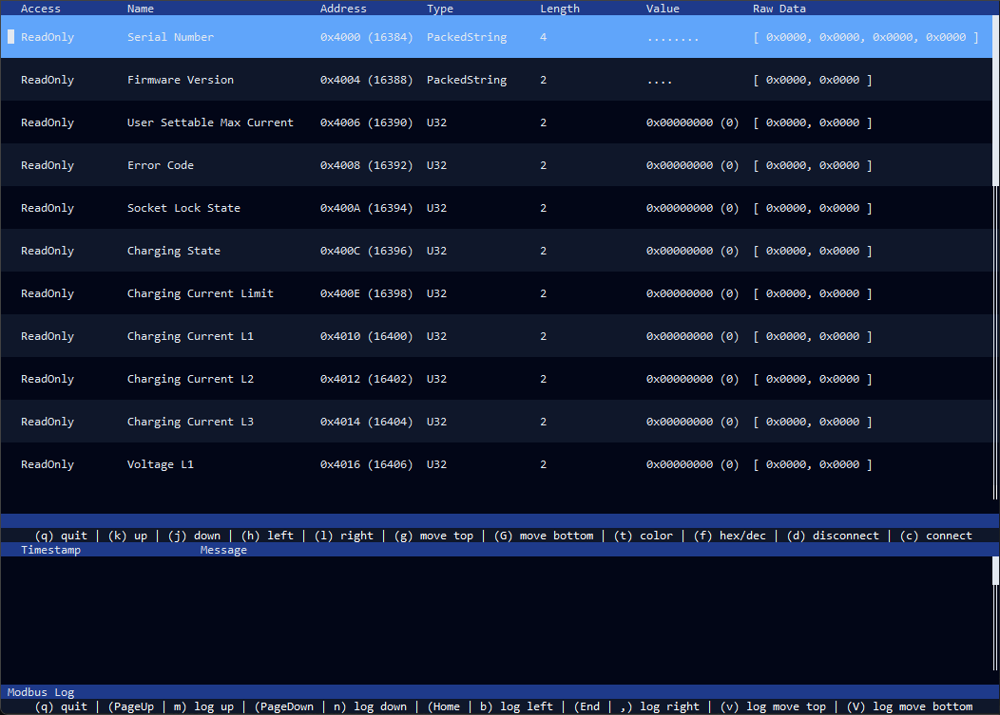

# Modbus CLI

Modbus CLI is a Rust implementation of a simple and intuative commandline application to interact with or simulate a modbus server. I started with the project because I'm used to work in environments that doesn't provide a GUI environment and my work required to handle different modbus use-cases.

If you prefer a GUI application, check out [QModbus](https://github.com/ed-chemnitz/qmodbus/) or similar applications.

## Goal

Provide a CLI application that can interact with a modbus server and modbus clients and visualize the status of modbus registers with live updates.

## Impressions

<p align="center">
    <p align="center">
        
    </p>
</p>

## Features

- [x] Modbus server that allows clients to manipulate the registers.
- [x] Modbus client to read and display all reigster contents of a modbus server.
- [x] Allow the manipulation of register contents in server and client mode.
- [x] Support TCP modbus
- [ ] Support RTU modbus

## Quickstart

This project is written in Rust, thus you will have to install the rust toolchain to compile it. Just follow the instructions on [rustup.rs](https://rustup.rs/)
to set up the environment. Afterwards you are able to compile this project from source using the following command.

```sh
cargo build --release
```

Alternatively, you can also run it directly using the following command.

```sh
cargo run --release -- -i <ip> -p <port> ./path/to/config.json
```

Please refer to `--help` for all available options.

## Configuration

The application will need a JSON configuration file. Besides some basic configuration parameters the configuration provides the register definitions.
These definitions are used to provide the table view and also group multiple registers together to e.g. limit read operations.

The configuraation has to contain the following entries.

```json
{
    "history_length": 30,
    "interval_ms": 500,
    "contiguous_memory": [],
    "definitions": {}
}
```

The `history_length` defines the scroll back limit of the displayed log messages. The parameter `interval_ms` specifies the frequency of read operations
and is only used if the `modbus-cli-rs` application is executed in client mode using the `-c` flag. Based on the modbus server it may be necessary to
increase the duration if it can only handle a limited amount of commands per second.

In `contiguous_memory` you can define address ranges that are available on a modbus server. This is used to group multiple registers together and
reduce the amount of read commands. E.g. if you have two registers `0x200` and `0x202` and both registers have length 1, the client would perform
two read commands since `0x201` is unused and separates the two registers. By adding the following entry to `contiguous_memory`, you specify that
the range `[ 0x200, 0x202 ]` is provided by the modbus server and thus can be read using a single command without receiving a `Illigal Address`
exception because of `0x201`.

```json
"contiguous_memory": [
    {
        "read_code": 4,
        "range": {
            "start": "0x200",
            "end": "0x202"
        }
    }
]
```

You can define all registers by adding the entries for each register to the `definitions` map. A definition entry looks like this.

```json
"Serial Number": {
    "read_code": 4,
    "address": "0x4000",
    "length": 4,
    "access": "ReadOnly",
    "type": "PackedString"
}
```

Please refer to `config.json` of this repository for a example configuration based on the ABB Terra AC wallbox.
