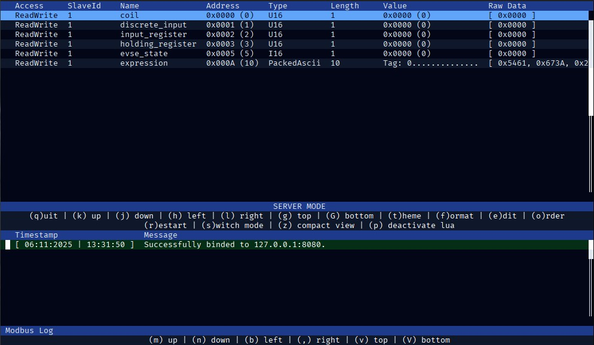

# Modbus CLI

[](https://github-ci.code-ape.dev/repos/3)

Modbus CLI is a Rust implementation of a simple and intuative commandline application to interact with or simulate a modbus server. I started with the project because I'm used to work in environments that doesn't provide a GUI environment and my work required to handle different modbus use-cases.

If you prefer a GUI application, check out [QModbus](https://github.com/ed-chemnitz/qmodbus/) or similar applications.

## Goal

Provide a CLI application that can interact with a modbus server and modbus clients and visualize the status of modbus registers with live updates.

## Impressions

### Default View

<p align="center">
    <p align="center">
        
    </p>
</p>

### Compact View

<p align="center">
    <p align="center">
        
    </p>
</p>

## Features

- [x] Modbus server that allows clients to manipulate the registers.
- [x] Modbus client to read and display all reigster contents of a modbus server.
- [x] Allow the manipulation of register contents in server and client mode.
- [x] Support TCP modbus
- [x] Support RTU modbus
- [x] Support of Lua scripts to manipulate registers at runtime (check out [Lua Support](#lua-support))
- [ ] Optional: Support separated memory backends for read/write (e.g. Hypercharger utilizes the same addresses for different information depending on the used function code)

## Quickstart

This project is written in Rust, thus you will have to install the rust toolchain to compile it. Just follow the instructions on [rustup.rs](https://rustup.rs/)
to set up the environment. Afterwards you are able to compile this project from source using the following command.

```sh
cargo build --release
```

Alternatively, you can also run it directly using the following command. Please refer to `--help` for all available runtime options.

### Server Mode

```bash
cargo run --release -- --config ./path/to/config.json tcp -i <ip> -p <port>

# Or with the application already built
modbus-cli-rs --config ./path/to/config.sjon tcp -i <ip> -p <port>
```

### Client Mode

```bash
cargo run --release -- --client --config ./path/to/config.json tcp -i <ip> -p <port>

# Or with the application already built
modbus-cli-rs --client --config ./path/to/config.sjon tcp -i <ip> -p <port>
```

## Keybindings

| Keybind | Description |
| ----- | ----- |
| `q` | Exit the application or exit edit mode. |
| `Escape` | Exit edit mode. |
| `o` | Change the order of the registers. |
| `r` | Restart the application. |
| `s` | Switch mode of the application. |
| `t` | Change color theme. |
| `d` | Disconnect client (only available in client mode). |
| `c` | Connect client (only avaialable in client mode). |
| `p` | Toggle lua execution (enable/disable). |
| `e | Enter` | Select register for editing. |
| `j | Down` | Select next register in table. |
| `k | Up` | Select previous register in table. |
| `h | Left` | Scroll left in register table. |
| `l | Right` | Scroll right in register table. |
| `f | Tab` | Change display format between hexadecimal and numeric. |
| `g` | Move to top of register table. |
| `G` | Move to bottom of register table. |
| `z` | Use compact register table view. |
| `m | PageUp` | Scroll up in log view. |
| `n | PageDown` | Scroll down in log view. |
| `b | Home` | Scroll left in log view. |
| `, | End` | Scroll right in log view. |
| `v` | Move to top of log view. |
| `V` | Move to bottom of log view. |

## Important Change

The tool now supports the configuration is TOML and JSON format. Additionally a new subcommand `convert` is added that takes the specified configuration and outputs it in the specified configuration format. The support of TOML is added to support easier multiline text values as part of the configuration which are used to specify Lua scripts.

```bash
# Convert JSON configuration to TOML (output: ./path/to/config.toml)
modbus-cli-rs --config ./path/to/config.json convert toml

# Convert TOML configuration to JSON (output: ./path/to/config.config)
modbus-cli-rs --config ./path/to/config.toml convert json
```

## Configuration

The application will need a JSON configuration file. Besides some basic configuration parameters the configuration provides the register definitions.
These definitions are used to provide the table view and also group multiple registers together to e.g. limit read operations.

The configuraation has to contain the following entries.

```json
{
    "history_length": 30,
    "interval_ms": 500,
    "delay_after_connect_ms": 500,
    "timeout_ms": 3000,
    "contiguous_memory": [],
    "definitions": {}
}
```

### Explanation

- `history_length`: Number of entries kept in the log history (lower view)
- `interval_ms`: Delay in milliseconds between two successive Modbus operations
- `delay_after_connect_ms`: Delay in milliseconds between the successful connect and the first Modbus operation
- `timeout_ms`: Timeout in milliseconds for every Modbus operation
- `contiguous_memory`: Array of continguous memory sections (neighboring registers with the same function code and part of the same section will be grouped together if possible)
- `definitions`: Modbus register definitions

The `interval_ms`, `delay_after_connect_ms` and `timeout_ms` are only taken into account if the application is executed in client mode (`--client`). In this case these configuration parameters heavily depend on the targeted Modbus server. If the server is only able to handle a limited workload, you will have to increase these paramters.

## Contiguous Memory

In `contiguous_memory` you can define address ranges that are available on a modbus server. This is used to group multiple registers together and
reduce the amount of read commands. E.g. if you have two registers `0x200` and `0x202` and both registers have length 1, the client would perform
two read commands since `0x201` is unused and separates the two registers. By adding the following entry to `contiguous_memory`, you specify that
the range `[ 0x200, 0x202 ]` is provided by the modbus server and thus can be read using a single command without receiving a `Illigal Address`
exception. By default the `slave_id = 0` is used, if the modbus server has specific registers that are only available for a specific `slave_id`, you
can specify the specific `slave_id` for the memory range.

```json
"contiguous_memory": [
    {
        "slave_id": 1,
        "read_code": 4,
        "range": {
            "start": "0x200",
            "end": "0x202"
        }
    }
]
```

## Register Defintion

You can define all registers by adding the entries for each register to the `definitions` map. A definition entry looks like this. The `slave_id` is
here optional, too. If none is provided, `slave_id = 0` is used.

```json
"Charging State": {
    "slave_id": 2,
    "read_code": 4,
    "address": "0x4000",
    "length": 4,
    "access": "ReadOnly",
    "type": "I32",
    "reverse": false,
    "on_update": "C_Register:GetString(\"Serial Number\")",
    "values": [
        { "name": "Waiting", "value": 1 },
        { "name": "Plugged", "value": 2 },
        { "name": "Charging", "value": 3 },
        { "name": "Failure", "value": -1 },
        10
    ],
    "virtual": false
}
```

Please refer to the section [Lua Support](#lua-support) for information about the optional `on_update` property.

### Explanation:

- `slave_id`: The modbus slave identifier
- `read_code`: The modbus function code for read operation
- `address`: The modbus register address
- `length`: The successive modbus register count
- `access`: Accessability mode (either ReadOnly, WriteOnly or ReadWrite)
- `type`: The type that is represented by the modbus registers
- `reverse`: Define whether the registers have to be flipped before interpretation (default: `false`)
- `on_update`: Lua script to run on each update. See Lua section for details.
- `virtual`: Mark a register as virtual. Only required in client mode to prevent any read of the register.
- `values`: List of predefined values for selection in edit dialog. Either a object with properties `name` (for display purposes) and `value` or simply the value. If this property ist omitted, an Input field ist displyed while editing.

If you use the client mode `--client` the corresponding write codes for manipulating registers or coils are derived from the configured `read_code`. E.g. if you specify a `read_code` that corresponds to coils, the write code will be the function code associated with coils, and if you specify the `read_code` 3 or 4 for input and holding registers, the client will use function code 6 or 16 (depending on the length) to write the values. Please refer to `config.json` of this repository for a example configuration.

### Data Types

The following data types are currently supported and can be configured:

- `PackedAscii`: Every byte is an ASCII character (single register = 2 ASCII characters)
- `LooseAscii`: Every register contains only a single ASCII character
- `PackedUtf8`: All combined register values represent a valid UTF-8 string
- `LooseUtf8`: Every register is a single UTF-8 character
- `U8`: The register contains a single 8-bit unsigned value
- `U16`: The register contains a 16-bit unsigned value
- `U32`: The combined register contents contain a 32-bit unsigned value
- `U64`: The combined register contents contain a 32-bit unsigned value
- `U128`: The combined register contents contain a 32-bit unsigned value
- `U8`: The register contains a single 8-bit little-endian unsigned value
- `U16`: The register contains a 16-bit little-endian unsigned value
- `U32`: The combined register contents contain a 32-bit little-endian unsigned value
- `U64`: The combined register contents contain a 32-bit little-endian unsigned value
- `U128`: The combined register contents contain a 32-bit little-endian unsigned value
- `I8`: The register contains a single 8-bit signed value
- `I16`: The register contains a 16-bit signed value
- `I32`: The combined register contents contain a 32-bit signed value
- `I64`: The combined register contents contain a 32-bit signed value
- `I128`: The combined register contents contain a 32-bit signed value
- `I8`: The register contains a single 8-bit little-endian signed value
- `I16`: The register contains a 16-bit little-endian signed value
- `I32`: The combined register contents contain a 32-bit little-endian signed value
- `I64`: The combined register contents contain a 32-bit little-endian signed value
- `I128`: The combined register contents contain a 32-bit little-endian signed value
- `F32`: The combined register contents contain a 32-bit float value
- `F32le`: The combined register contents contain a 32-bit little-endian float value
- `F64`: The combined register contents contain a 64-bit float value
- `F64le`: The combined register contents contain a 64-bit little-endian float value

### Lua Support

Since the user may be interested in adding virtual registers that will use information of other registers to combine them into a single value, instead of adding a custom parser to provide support of expressions, we add support of the Lua programming language to simply use the full potential of it. Currently lua script are only used in the `on_update` property. The lua script will be executed each cycle and can read and write any registers the user is interested in. Besides the standard libraries provided by lua itself, the following predefined modules are available.

#### Module C_Time

```
Method:   C_Time:Get()

Arguments: None

Return: Time in seconds since startup.
```
```
Method:   C_Time:GetMs()

Arguments: None

Return: Time in milliseconds since startup.
```

#### Module C_Register

```
Method:   C_Register:GetString(name)

Arguments:
               Name: name
               Type: String
        Description: Name of the register as defined in the configuration.

Return: String value of the register
```
```
Method:   C_Register:GetInt(name)

Arguments:
               Name: name
               Type: String
        Description: Name of the register as defined in the configuration.

Return: Integer value of the register
```
```
Method:   C_Register:GetFloat(name)

Arguments:
               Name: name
               Type: String
        Description: Name of the register as defined in the configuration.

Return: Floating point value of the register
```
```
Method:   C_Register:GetBool(name)

Arguments:
               Name: name
               Type: String
        Description: Name of the register as defined in the configuration.

Return: Boolean value of the register
```
```
Method:   C_Register:Set(name, value)

Arguments:
               Name: name
               Type: String
        Description: Name of the register as defined in the configuration.

               Name: value
               Type: String | bool | integer | float
        Description: Value to set for the specified register

Return: nil
```
